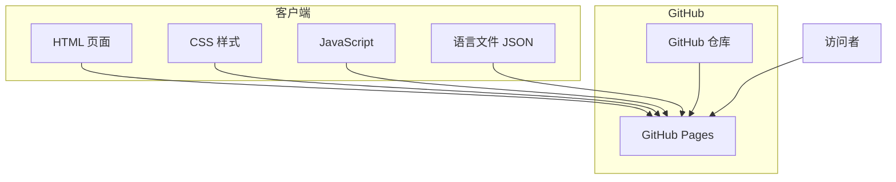

# 设计文档

## 概述

本设计文档描述了一个支持中英双语的个人作品集网站的技术架构和实现方案。网站采用纯静态方案，使用 HTML、CSS 和 JavaScript 构建，可直接部署到 GitHub Pages。设计风格为蓝白冷色调浅色主题，提供简洁专业的视觉体验。

## 架构

### 技术栈选择

- **HTML5**: 语义化标记结构
- **CSS3**: 样式和响应式布局（使用 CSS 变量管理主题色）
- **Vanilla JavaScript**: 语言切换和交互逻辑（无框架依赖）
- **GitHub Pages**: 静态网站托管

### 架构图



### 文件结构

```
portfolio/
├── index.html          # 主页面
├── css/
│   └── style.css       # 样式文件
├── js/
│   ├── main.js         # 主逻辑
│   └── i18n.js         # 国际化模块
├── locales/
│   ├── zh.json         # 中文文本
│   └── en.json         # 英文文本
├── assets/
│   └── images/         # 图片资源
└── README.md
```

## 组件和接口

### 1. 页面布局组件

#### Header 组件
- 包含网站标题/Logo 和语言切换按钮
- 固定在页面顶部
- 响应式：移动端简化显示

#### Hero 区域
- 个人头像（圆形裁剪）
- 姓名和职业标题
- 简短的个人简介
- 社交媒体链接图标

#### Skills 区域
- 技能分类标题
- 技能标签网格布局
- 熟练度指示（可选：进度条或星级）

#### Projects 区域
- 项目卡片网格
- 每个卡片包含：缩略图、标题、描述、技术栈标签、链接按钮
- 支持项目类型标签（AI/Web/Desktop）
- 点击卡片可展开查看更多媒体资源（截图轮播、架构图、GIF）

#### Footer 组件
- 版权信息
- 联系邮箱
- 返回顶部按钮

### 2. 国际化模块接口

```javascript
// i18n.js 模块接口
const i18n = {
  currentLocale: 'zh',  // 当前语言
  
  // 初始化：检测浏览器语言或读取本地存储
  init(): void,
  
  // 切换语言
  setLocale(locale: 'zh' | 'en'): void,
  
  // 获取翻译文本
  t(key: string): string,
  
  // 更新页面所有文本
  updatePageTexts(): void
}
```

### 3. 语言文件结构

```json
// locales/zh.json 示例
{
  "nav": {
    "skills": "技能",
    "projects": "项目",
    "contact": "联系"
  },
  "hero": {
    "greeting": "你好，我是",
    "title": "全栈开发工程师",
    "description": "热爱编程，专注于..."
  },
  "skills": {
    "title": "技能",
    "frontend": "前端",
    "backend": "后端",
    "tools": "工具"
  },
  "projects": {
    "title": "项目作品",
    "viewCode": "查看源码",
    "viewDemo": "在线演示"
  },
  "footer": {
    "copyright": "© 2024 版权所有"
  }
}
```

## 数据模型

### 个人信息模型

```typescript
interface PersonalInfo {
  name: {
    zh: string;
    en: string;
  };
  title: {
    zh: string;
    en: string;
  };
  avatar: string;  // 图片路径
  bio: {
    zh: string;
    en: string;
  };
  email: string;
  social: {
    github?: string;
    linkedin?: string;
    twitter?: string;
  };
}
```

### 技能模型

```typescript
interface Skill {
  name: string;
  category: 'frontend' | 'backend' | 'tools' | 'other';
  level?: number;  // 1-5 熟练度（可选）
}

interface SkillCategory {
  id: string;
  label: {
    zh: string;
    en: string;
  };
  skills: Skill[];
}
```

### 项目模型

```typescript
// 项目类型枚举
type ProjectType = 'ai-vision' | 'ai-llm' | 'web-iot' | 'web-platform' | 'desktop' | 'other';

// 媒体资源类型
interface ProjectMedia {
  screenshots?: string[];      // 截图数组（支持多张）
  gif?: string;                // 演示 GIF 动图
  architectureDiagram?: string; // 架构图（Mermaid 或图片路径）
  video?: string;              // 视频链接（可选，如 YouTube/Bilibili）
}

interface Project {
  id: string;
  type: ProjectType;           // 项目类型分类
  title: {
    zh: string;
    en: string;
  };
  description: {
    zh: string;
    en: string;
  };
  thumbnail?: string;          // 缩略图路径（卡片展示用）
  media?: ProjectMedia;        // 多媒体资源（详情展示用）
  techStack: string[];
  links: {
    demo?: string;             // 在线演示（可选）
    github?: string;           // 源码仓库（可选）
  };
  highlights?: {               // 项目亮点（可选）
    zh: string[];
    en: string[];
  };
}
```

### 项目类型说明

| 类型 | 说明 | 典型展示方式 |
|-----|------|-------------|
| `ai-vision` | AI 视觉项目 | 截图 + 架构图 |
| `ai-llm` | 大语言模型项目 | 截图 + 架构图 + GIF |
| `web-iot` | 物联网 Web 平台 | 马赛克截图 |
| `web-platform` | Web 平台/系统 | 马赛克截图 |
| `desktop` | 桌面应用 | 截图 + GIF |
| `other` | 其他类型 | 截图 |


## 正确性属性

*属性是一种在系统所有有效执行中都应保持为真的特征或行为——本质上是关于系统应该做什么的形式化陈述。属性是人类可读规范和机器可验证正确性保证之间的桥梁。*

### Property 1: 简介文本长度限制

*对于任意* 个人简介文本，其字符长度应不超过 300 字

**验证: 需求 1.2**

### Property 2: 技能分组正确性

*对于任意* 技能列表，分组函数应将每个技能正确归类到其所属类别，且不丢失任何技能

**验证: 需求 2.2**

### Property 3: 项目卡片信息完整性

*对于任意* 项目数据，渲染后的项目卡片应包含项目名称、描述、技术栈和链接信息

**验证: 需求 3.2**

### Property 4: 项目缩略图条件渲染

*对于任意* 包含缩略图的项目，渲染后的项目卡片应包含图片元素；对于不包含缩略图的项目，不应包含图片元素

**验证: 需求 3.4**

### Property 5: 语言检测正确性

*对于任意* 浏览器语言设置，语言检测函数应返回 'zh' 或 'en'，且当浏览器语言包含 'zh' 时返回 'zh'，否则返回 'en'

**验证: 需求 7.1**

### Property 6: 语言切换往返一致性

*对于任意* 语言设置，保存到本地存储后再读取应返回相同的语言值

**验证: 需求 7.3, 7.4**

### Property 7: 语言切换状态变更

*对于任意* 当前语言状态，调用切换函数后当前语言应变为另一种语言（zh ↔ en）

**验证: 需求 7.2**

## 错误处理

### 语言文件加载失败
- 如果语言 JSON 文件加载失败，回退到默认语言（中文）
- 在控制台记录错误信息

### 本地存储不可用
- 如果 localStorage 不可用（如隐私模式），语言切换仍然有效，但不会持久化
- 使用 try-catch 包装存储操作

### 图片加载失败
- 项目缩略图加载失败时显示占位图
- 头像加载失败时显示默认头像

### 无效数据处理
- 技能或项目数据格式错误时跳过该项，不影响其他内容显示

## 测试策略

### 单元测试

使用 Jest 进行单元测试，覆盖以下模块：

1. **i18n 模块测试**
   - 语言检测函数
   - 语言切换函数
   - 翻译文本获取函数

2. **数据处理函数测试**
   - 技能分组函数
   - 项目卡片渲染函数

### 属性测试

使用 fast-check 进行属性测试，验证正确性属性：

1. **Property 1**: 生成随机字符串，验证长度限制
2. **Property 2**: 生成随机技能列表，验证分组结果
3. **Property 3**: 生成随机项目数据，验证渲染完整性
4. **Property 4**: 生成有/无缩略图的项目，验证条件渲染
5. **Property 5**: 生成随机语言代码，验证检测结果
6. **Property 6**: 生成随机语言设置，验证存储往返
7. **Property 7**: 生成随机初始语言，验证切换结果

### 测试配置

- 每个属性测试运行至少 100 次迭代
- 测试文件与源文件同目录，使用 `.test.js` 后缀

## 视觉设计规范

### 配色方案（蓝白冷色调）

```css
:root {
  /* 主色调 */
  --primary-color: #2563eb;      /* 蓝色 */
  --primary-light: #3b82f6;      /* 浅蓝色 */
  --primary-dark: #1d4ed8;       /* 深蓝色 */
  
  /* 背景色 */
  --bg-primary: #ffffff;         /* 白色背景 */
  --bg-secondary: #f8fafc;       /* 浅灰背景 */
  --bg-tertiary: #f1f5f9;        /* 卡片背景 */
  
  /* 文字色 */
  --text-primary: #1e293b;       /* 主要文字 */
  --text-secondary: #64748b;     /* 次要文字 */
  --text-light: #94a3b8;         /* 浅色文字 */
  
  /* 边框色 */
  --border-color: #e2e8f0;       /* 边框 */
  
  /* 阴影 */
  --shadow-sm: 0 1px 2px rgba(0, 0, 0, 0.05);
  --shadow-md: 0 4px 6px rgba(0, 0, 0, 0.07);
}
```

### 字体

```css
:root {
  --font-sans: -apple-system, BlinkMacSystemFont, 'Segoe UI', Roboto, 'Helvetica Neue', Arial, sans-serif;
  --font-mono: 'SF Mono', Monaco, 'Cascadia Code', monospace;
}
```

### 响应式断点

```css
/* 移动端优先 */
/* 平板: min-width: 768px */
/* 桌面: min-width: 1024px */
/* 大屏: min-width: 1280px */
```
