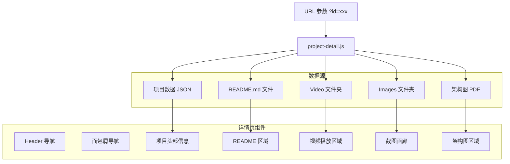

# 设计文档

## 概述

本设计文档描述了作品集网站项目详情页功能的技术架构和实现方案。详情页采用独立 HTML 页面方式，通过 URL 参数传递项目 ID，动态加载并展示项目的 README 文档、演示视频、截图画廊和架构图等多媒体资源。

## 架构

### 技术栈选择

- **HTML5**: 详情页页面结构
- **CSS3**: 样式和响应式布局（复用主站 CSS 变量）
- **Vanilla JavaScript**: 页面逻辑和组件交互
- **marked.js**: Markdown 解析库（轻量级，无依赖）
- **highlight.js**: 代码语法高亮（可选）

### 页面路由方案

采用基于 URL 参数的静态页面路由：
- 详情页 URL: `project.html?id=ai-vision`
- 项目 ID 对应 Projects 文件夹下的目录名

### 文件结构

```
portfolio/
├── index.html              # 主页面
├── project.html            # 项目详情页（新增）
├── css/
│   └── style.css           # 样式文件（扩展详情页样式）
├── js/
│   ├── main.js             # 主页逻辑
│   ├── i18n.js             # 国际化模块
│   └── project-detail.js   # 详情页逻辑（新增）
├── locales/
│   ├── zh.json             # 中文文本（扩展详情页文本）
│   └── en.json             # 英文文本
├── Projects/               # 项目资源目录
│   ├── AIVison/
│   │   ├── README_EN.md
│   │   ├── Images/
│   │   └── Video/
│   ├── IOTsystem/
│   │   ├── Readme.md
│   │   └── Image/
│   └── ...
└── assets/
    └── images/
```

### 架构图



## 组件和接口

### 1. 项目详情页布局

```
┌─────────────────────────────────────────────────────┐
│  Header (复用主站)                    [语言切换]    │
├─────────────────────────────────────────────────────┤
│  首页 > 项目 > AI Vision Inspector                  │
├─────────────────────────────────────────────────────┤
│  ┌─────────────────────────────────────────────┐    │
│  │  项目标题                                    │    │
│  │  [AI-Vision] [.NET] [WPF] [ONNX]            │    │
│  │  项目简介...                                 │    │
│  │  [查看源码] [在线演示]                       │    │
│  └─────────────────────────────────────────────┘    │
├─────────────────────────────────────────────────────┤
│  📹 演示视频                                        │
│  ┌─────────────────────┐  ┌──────────────────┐     │
│  │                     │  │ • 视频1          │     │
│  │   视频播放器        │  │ • 视频2          │     │
│  │                     │  │ • 视频3          │     │
│  └─────────────────────┘  └──────────────────┘     │
├─────────────────────────────────────────────────────┤
│  📷 项目截图                                        │
│  ┌─────┐ ┌─────┐ ┌─────┐ ┌─────┐ ┌─────┐          │
│  │     │ │     │ │     │ │     │ │     │          │
│  └─────┘ └─────┘ └─────┘ └─────┘ └─────┘          │
├─────────────────────────────────────────────────────┤
│  📐 架构图                                          │
│  ┌─────────────────────────────────────────────┐    │
│  │  架构图预览 / PDF 下载链接                   │    │
│  └─────────────────────────────────────────────┘    │
├─────────────────────────────────────────────────────┤
│  📖 项目文档                                        │
│  ┌─────────────────────────────────────────────┐    │
│  │  README 内容渲染区域                         │    │
│  │  - 功能特性                                  │    │
│  │  - 技术栈                                    │    │
│  │  - 使用说明                                  │    │
│  └─────────────────────────────────────────────┘    │
├─────────────────────────────────────────────────────┤
│  Footer (复用主站)                                  │
└─────────────────────────────────────────────────────┘
```

### 2. 项目详情模块接口

```javascript
// project-detail.js 模块接口
const projectDetail = {
  // 从 URL 获取项目 ID
  getProjectId(): string,
  
  // 根据 ID 获取项目数据
  getProjectData(id: string): Project,
  
  // 加载并渲染 README
  loadReadme(projectPath: string, locale: string): Promise<string>,
  
  // 渲染 Markdown 为 HTML
  renderMarkdown(markdown: string): string,
  
  // 初始化视频播放器
  initVideoPlayer(videos: string[]): void,
  
  // 初始化截图画廊
  initGallery(screenshots: string[]): void,
  
  // 初始化灯箱组件
  initLightbox(): void,
  
  // 渲染页面
  render(): void
}
```

### 3. 灯箱组件接口

```javascript
// lightbox 组件
const lightbox = {
  isOpen: false,
  currentIndex: 0,
  images: [],
  
  // 打开灯箱
  open(images: string[], startIndex: number): void,
  
  // 关闭灯箱
  close(): void,
  
  // 切换到上一张
  prev(): void,
  
  // 切换到下一张
  next(): void,
  
  // 键盘事件处理
  handleKeydown(event: KeyboardEvent): void
}
```

## 数据模型

### 扩展项目模型

```typescript
interface ProjectDetail extends Project {
  // 继承基础项目字段
  id: string;
  type: ProjectType;
  title: { zh: string; en: string; };
  description: { zh: string; en: string; };
  thumbnail?: string;
  techStack: string[];
  links: { demo?: string; github?: string; };
  
  // 详情页扩展字段
  assetsPath: string;           // 项目资源目录路径，如 "Projects/AIVison"
  readme?: {
    zh?: string;                // 中文 README 文件名
    en?: string;                // 英文 README 文件名
  };
  videos?: string[];            // 视频文件路径数组
  screenshots?: string[];       // 截图文件路径数组
  architectureDiagram?: {
    type: 'pdf' | 'image';      // 架构图类型
    path: string;               // 文件路径
  };
}
```

### 项目资源映射配置

```javascript
// 项目资源配置（在 main.js 中扩展）
const projectAssets = {
  'ai-vision': {
    assetsPath: 'Projects/AIVison',
    readme: {
      zh: 'README_EN.md',  // 暂时都用英文版
      en: 'README_EN.md'
    },
    videos: [
      'Video/demo1.mp4',
      'Video/demo2.mp4'
    ],
    screenshots: [
      'Images/main_window.PNG',
      'Images/inference_result.PNG',
      'Images/training_dialog.PNG',
      'Images/camera_preview.PNG',
      'Images/statistics_dashboard.PNG'
    ],
    architectureDiagram: {
      type: 'pdf',
      path: 'ARCHITECTURE.pdf'
    }
  },
  'iot-system': {
    assetsPath: 'Projects/IOTsystem',
    readme: {
      zh: 'Readme.md',
      en: 'Readme.md'
    },
    screenshots: [
      'Image/screenshot1.png',
      'Image/screenshot2.png'
    ]
  },
  'project-management': {
    assetsPath: 'Projects/Project Management',
    readme: {
      zh: 'README_EN.md',
      en: 'README_EN.md'
    },
    videos: [
      'Video/demo.mp4'
    ],
    screenshots: [
      'Images/dashboard.png',
      'Images/projects.png'
    ],
    architectureDiagram: {
      type: 'image',
      path: 'ARCHITECTURE_EN.html'
    }
  },
  'sam3': {
    assetsPath: 'Projects/SAM3',
    videos: [
      'Sam3 -Prompt-based all-in-one segmentation large model.mp4'
    ],
    screenshots: [
      'SAM3-Web Deploy.png'
    ]
  }
};
```

## 正确性属性

*属性是一种在系统所有有效执行中都应保持为真的特征或行为——本质上是关于系统应该做什么的形式化陈述。属性是人类可读规范和机器可验证正确性保证之间的桥梁。*

### Property 1: 项目详情页头部信息完整性

*对于任意* 有效的项目数据，渲染后的详情页头部应包含项目标题、类型标签和技术栈信息

**验证: 需求 1.4**

### Property 2: Markdown 渲染往返一致性

*对于任意* 有效的 Markdown 文本，渲染为 HTML 后应保留所有文本内容（标签除外）

**验证: 需求 2.1, 2.2**

### Property 3: README 回退渲染

*对于任意* 无 README 文件的项目，详情页应显示项目的基本描述信息而非空白

**验证: 需求 2.4**

### Property 4: 视频列表条件渲染

*对于任意* 包含视频的项目，详情页应渲染视频播放器；对于不包含视频的项目，不应渲染视频区域

**验证: 需求 3.1**

### Property 5: 多视频列表渲染

*对于任意* 包含多个视频的项目，视频列表应包含所有视频项，且数量与源数据一致

**验证: 需求 3.3**

### Property 6: 截图画廊条件渲染

*对于任意* 包含截图的项目，详情页应渲染截图网格；截图数量应与源数据一致

**验证: 需求 4.1**

### Property 7: 灯箱索引边界处理

*对于任意* 截图列表和当前索引，切换到下一张时索引应循环到开头；切换到上一张时索引应循环到末尾

**验证: 需求 4.3**

### Property 8: 语言切换 README 路径选择

*对于任意* 语言设置（zh 或 en），README 加载函数应返回对应语言的文件路径

**验证: 需求 6.2**

## 错误处理

### README 加载失败
- 如果 README 文件不存在或加载失败，显示项目的基本描述信息
- 在控制台记录错误信息

### 视频加载失败
- 视频加载失败时显示错误提示和重试按钮
- 使用 video 元素的 onerror 事件处理

### 图片加载失败
- 截图加载失败时显示占位图
- 使用 img 元素的 onerror 事件处理

### 无效项目 ID
- 如果 URL 参数中的项目 ID 无效，显示"项目不存在"提示
- 提供返回首页的链接

## 测试策略

### 单元测试

使用 Jest 进行单元测试：

1. **URL 参数解析测试**
   - 正确提取项目 ID
   - 处理无效或缺失参数

2. **Markdown 渲染测试**
   - 标题、列表、代码块渲染
   - 特殊字符处理

3. **灯箱组件测试**
   - 索引边界处理
   - 打开/关闭状态切换

### 属性测试

使用 fast-check 进行属性测试：

1. **Property 1**: 生成随机项目数据，验证头部渲染完整性
2. **Property 2**: 生成随机 Markdown，验证渲染后文本保留
3. **Property 3**: 生成无 README 的项目，验证回退渲染
4. **Property 4**: 生成有/无视频的项目，验证条件渲染
5. **Property 5**: 生成多视频项目，验证列表数量
6. **Property 6**: 生成有截图的项目，验证画廊渲染
7. **Property 7**: 生成随机索引和列表长度，验证边界循环
8. **Property 8**: 生成随机语言设置，验证路径选择

### 测试配置

- 每个属性测试运行至少 100 次迭代
- 测试文件使用 `.test.js` 后缀

## 视觉设计规范

### 详情页特有样式

```css
/* 面包屑导航 */
.breadcrumb {
  padding: 1rem 0;
  color: var(--text-secondary);
  font-size: 0.875rem;
}

.breadcrumb a {
  color: var(--primary-color);
  text-decoration: none;
}

/* 项目头部 */
.project-header {
  padding: 2rem 0;
  border-bottom: 1px solid var(--border-color);
}

/* 视频播放器 */
.video-player {
  max-width: 100%;
  border-radius: 8px;
  background: #000;
}

/* 截图画廊 */
.gallery-grid {
  display: grid;
  grid-template-columns: repeat(auto-fill, minmax(200px, 1fr));
  gap: 1rem;
}

.gallery-item {
  cursor: pointer;
  border-radius: 8px;
  overflow: hidden;
  transition: transform 0.2s;
}

.gallery-item:hover {
  transform: scale(1.02);
}

/* 灯箱 */
.lightbox {
  position: fixed;
  inset: 0;
  background: rgba(0, 0, 0, 0.9);
  display: flex;
  align-items: center;
  justify-content: center;
  z-index: 1000;
}

.lightbox-image {
  max-width: 90vw;
  max-height: 90vh;
  object-fit: contain;
}

/* README 内容样式 */
.readme-content {
  line-height: 1.8;
}

.readme-content h1,
.readme-content h2,
.readme-content h3 {
  margin-top: 1.5em;
  margin-bottom: 0.5em;
}

.readme-content pre {
  background: var(--bg-tertiary);
  padding: 1rem;
  border-radius: 8px;
  overflow-x: auto;
}

.readme-content code {
  font-family: var(--font-mono);
  font-size: 0.875em;
}
```

### 响应式断点

```css
/* 移动端 */
@media (max-width: 767px) {
  .video-section {
    flex-direction: column;
  }
  
  .gallery-grid {
    grid-template-columns: repeat(2, 1fr);
  }
}
```

