# 🏗️ ProjectFlow System Architecture

This document describes the technical architecture, design decisions, and implementation details of the ProjectFlow project management system.

---

## 📐 System Architecture Overview

### Overall Architecture Diagram

```mermaid
graph TB
    subgraph "Client Layer"
        Browser[🌐 Browser]
        VanillaJS[📄 Vanilla JS Version<br/>pm.html + ES6 Modules]
        VueApp[⚡ Vue 3 Version<br/>Vite + Pinia]
    end
    
    subgraph "API Gateway Layer"
        CORS[CORS Middleware]
        Auth[JWT Auth Middleware]
    end
    
    subgraph "Application Layer"
        FastAPI[🚀 FastAPI<br/>Python 3.12]
        Routes[API Routes]
        Services[Business Logic]
    end
    
    subgraph "Data Layer"
        ORM[SQLAlchemy 2.0<br/>ORM]
        S3Client[Boto3<br/>S3 Client]
    end
    
    subgraph "Storage Layer"
        PG[(🐘 PostgreSQL 16<br/>Primary Database)]
        MinIO[(📦 MinIO<br/>Object Storage)]
        LocalStorage[(💾 LocalStorage<br/>Offline Cache)]
    end
    
    subgraph "Infrastructure"
        Docker[🐳 Docker Compose]
        Alembic[🔄 Alembic<br/>DB Migrations]
    end
    
    Browser --> VanillaJS
    Browser --> VueApp
    VanillaJS --> LocalStorage
    VanillaJS --> CORS
    VueApp --> CORS
    CORS --> Auth
    Auth --> FastAPI
    FastAPI --> Routes
    Routes --> Services
    Services --> ORM
    Services --> S3Client
    ORM --> PG
    S3Client --> MinIO
    Docker --> PG
    Docker --> MinIO
    Docker --> FastAPI
    Alembic --> PG
```



### Deployment Architecture


---

## 🎨 Frontend Architecture

### Vanilla JS Version Architecture

Built with native ES6 modules, no framework dependencies, demonstrating pure JavaScript engineering capabilities.


### Core Design Patterns

#### 1. Data Service Layer (DataService)

```javascript
// Singleton Pattern + Observer Pattern
class DataService {
    constructor() {
        this.data = { projects: [], tasks: [], reports: [] };
        this.listeners = new Map();  // Event subscriptions
    }
    
    // Publish-Subscribe Pattern
    on(event, callback) { /* ... */ }
    emit(event, data) { /* ... */ }
    
    // Data Persistence
    saveToStorage() { localStorage.setItem('projectflow-data', JSON.stringify(this.data)); }
    loadFromStorage() { /* ... */ }
}
```

#### 2. Backend Sync Strategy

```javascript
// Strategy Pattern: Backend-first, fallback to local
async function saveTask(taskData) {
    if (isBackendEnabled()) {
        return await backend.createTask(taskData);  // Backend first
    } else {
        return addTaskLocal(taskData);  // Local fallback
    }
}
```

#### 3. Module Communication


### Vue 3 Version Architecture

Progressive migration version, demonstrating modern frontend framework capabilities.


---

## 🔧 Backend Architecture

### Layered Architecture


### Directory Structure

```
backend/app/
├── main.py              # FastAPI application entry
├── core/
│   ├── config.py        # Pydantic Settings configuration
│   ├── security.py      # JWT generation/validation, password hashing
│   └── deps.py          # Dependency injection (current user, DB session)
├── models/              # SQLAlchemy ORM models
│   ├── base.py          # Base class (id, created_at, updated_at)
│   ├── user.py
│   ├── project.py
│   ├── task.py
│   ├── task_dependency.py
│   ├── report.py
│   └── attachment.py
├── schemas/             # Pydantic data validation
│   ├── user.py
│   ├── project.py
│   ├── task.py
│   └── ...
├── api/routes/          # API routes
│   ├── auth.py          # Registration/Login
│   ├── projects.py      # Project CRUD
│   ├── tasks.py         # Task CRUD
│   ├── task_dependencies.py  # Task dependencies (Gantt chart)
│   ├── reports.py       # Report CRUD
│   └── attachments.py   # File upload
└── db/
    └── session.py       # Database session management
```

### Security Mechanisms

#### JWT Authentication Flow


#### Password Security

```python
# bcrypt hashing + salt
from passlib.context import CryptContext

pwd_context = CryptContext(schemes=["bcrypt"], deprecated="auto")

def hash_password(password: str) -> str:
    return pwd_context.hash(password)

def verify_password(plain: str, hashed: str) -> bool:
    return pwd_context.verify(plain, hashed)
```

### RESTful API Design

| Resource | Method | Endpoint | Description |
|----------|--------|----------|-------------|
| Projects | GET | `/projects` | List (with pagination) |
| Projects | POST | `/projects` | Create |
| Projects | GET | `/projects/{id}` | Details |
| Projects | PATCH | `/projects/{id}` | Partial update |
| Projects | DELETE | `/projects/{id}` | Delete |
| Tasks | GET | `/tasks?project_id=1&q=keyword` | List (with filtering) |
| Attachments | POST | `/attachments/presigned-url` | Get presigned upload URL |

### File Upload Flow


---

## 🗄️ Database Design

### ER Diagram


### Table Structure Details

#### Users Table

| Field | Type | Constraints | Description |
|-------|------|-------------|-------------|
| id | INTEGER | PK, AUTO | Primary key |
| email | VARCHAR | UNIQUE, NOT NULL | Email (login name) |
| name | VARCHAR | NOT NULL | Username |
| hashed_password | VARCHAR | NOT NULL | bcrypt hashed password |
| is_active | BOOLEAN | DEFAULT TRUE | Account status |
| created_at | TIMESTAMP | DEFAULT NOW | Creation time |
| updated_at | TIMESTAMP | ON UPDATE | Update time |

#### Projects Table

| Field | Type | Constraints | Description |
|-------|------|-------------|-------------|
| id | INTEGER | PK, AUTO | Primary key |
| name | VARCHAR | NOT NULL | Project name |
| description | TEXT | | Project description |
| status | VARCHAR | CHECK IN ('pending', 'active', 'completed') | Status |
| progress | INTEGER | CHECK 0-100 | Progress percentage |
| deadline | DATE | | Deadline |
| team_size | INTEGER | DEFAULT 1 | Team size |
| owner_id | INTEGER | FK -> users.id | Owner |

#### Tasks Table

| Field | Type | Constraints | Description |
|-------|------|-------------|-------------|
| id | INTEGER | PK, AUTO | Primary key |
| title | VARCHAR | NOT NULL | Task title |
| description | TEXT | | Task description |
| status | VARCHAR | CHECK IN ('pending', 'active', 'completed') | Status |
| priority | VARCHAR | CHECK IN ('low', 'medium', 'high') | Priority |
| progress | INTEGER | CHECK 0-100 | Progress |
| start_date | DATE | | Start date |
| end_date | DATE | | End date |
| project_id | INTEGER | FK -> projects.id | Parent project |
| assignee_id | INTEGER | FK -> users.id | Assignee |

### Index Strategy

```sql
-- Task query optimization
CREATE INDEX idx_task_project_status ON tasks(project_id, status);
CREATE INDEX idx_task_project_dates ON tasks(project_id, start_date, end_date);

-- Report query optimization
CREATE INDEX idx_report_project_date ON reports(project_id, date);
CREATE INDEX idx_report_project_status ON reports(project_id, status);

-- User query optimization
CREATE UNIQUE INDEX idx_user_email ON users(email);
```

---

## 🔄 Data Flow

### User Authentication Flow


### Task CRUD Operation Flow


### Report PDF Export Flow


---

## 🎯 Design Patterns & Code Highlights

### Design Patterns Used

| Pattern | Use Case | Implementation Location |
|---------|----------|------------------------|
| **Singleton** | DataService global state management | `js/modules/dataService.js` |
| **Observer** | Event-driven component communication | `DataService.on/emit` |
| **Strategy** | Backend/local storage switching | `backendSync.js` |
| **Factory** | Dynamic UI component creation | `components.js` |
| **Dependency Injection** | FastAPI dependency management | `backend/app/core/deps.py` |
| **Repository** | Data access abstraction | SQLAlchemy Models |
| **Adapter** | Frontend-backend data format conversion | Pydantic Schemas |

### Code Quality Highlights

#### 1. Frontend Modularization

```javascript
// ES6 modules with clear dependencies
import { dataService } from './dataService.js';
import { showNotification } from './notifications.js';
import { modal } from './components.js';

// Export public API
export { setupTaskActions, filterTasks, updateStatisticsDisplay };
```

#### 2. Type Safety (Backend)

```python
# Pydantic data validation
class TaskCreate(BaseModel):
    title: str = Field(..., min_length=1, max_length=200)
    priority: Literal["low", "medium", "high"] = "medium"
    project_id: int
    
    @validator('title')
    def title_not_empty(cls, v):
        if not v.strip():
            raise ValueError('Title cannot be empty')
        return v.strip()
```

#### 3. Database Constraints

```python
# SQLAlchemy model constraints
__table_args__ = (
    CheckConstraint('progress >= 0 AND progress <= 100', name='check_progress_range'),
    CheckConstraint("status IN ('pending', 'active', 'completed')", name='check_status_values'),
    Index('idx_task_project_status', 'project_id', 'status'),
)
```

#### 4. Accessibility Support

```javascript
// ARIA labels and keyboard navigation
const modal = {
    confirm: async ({ title, message, type }) => {
        // Add ARIA attributes when creating modal
        modalEl.setAttribute('role', 'dialog');
        modalEl.setAttribute('aria-modal', 'true');
        modalEl.setAttribute('aria-labelledby', 'modal-title');
        
        // Focus management
        const firstFocusable = modalEl.querySelector('button');
        firstFocusable?.focus();
    }
};
```

#### 5. Error Handling

```javascript
// Unified error handling and user feedback
try {
    if (isBackendEnabled()) {
        await backend.createTask(taskData);
    } else {
        addTaskLocal(taskData);
    }
    showNotification('Success', 'Task created successfully');
} catch (error) {
    console.error('Failed to save task:', error);
    showNotification('Error', 'An error occurred while saving the task', 'error');
}
```

### Performance Optimizations

| Optimization | Implementation |
|--------------|----------------|
| Lazy Loading | Chart.js, PDF libraries loaded on demand |
| Debouncing | Search input debounced at 200ms |
| Virtual Scrolling | Large lists with pagination |
| Database Indexes | Composite indexes for query optimization |
| Presigned URLs | Direct file upload to MinIO, reducing backend load |

---

## 📚 Related Documentation

- [README.md](../README.md) - Project Introduction (Chinese)
- [README_EN.md](../README_EN.md) - Project Introduction (English)
- [DEMO_SCRIPT.md](./DEMO_SCRIPT.md) - Demo Script
- [API Documentation](http://localhost:8000/docs) - Swagger UI

---

<div align="center">

*This document is continuously updated*

</div>
